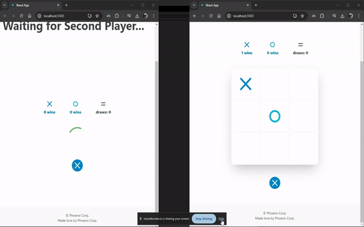

# Tic Tac Toe Game 🎮

Welcome to our Tic Tac Toe game project! Play against a friend or challenge the computer in this classic game of strategy and wit. The game features a real-time multiplayer mode built with React on the frontend and Node.js on the backend. Let's dive in!

## Features 🚀

- **Real-time Gameplay:** Play against friends or random opponents in real time.
- **Responsive Design:** Enjoy a seamless gaming experience on desktop, tablet, or mobile devices.
- **Multiplayer Mode:** Challenge your friends or get matched with opponents from around the world.
- **AI Opponent:** Test your skills against a computer opponent with varying levels of difficulty.
- **Interactive Interface:** Intuitive and user-friendly interface for smooth gameplay.

## Tech Stack 💻

- **Frontend:** Built with React.js, utilizing components for modular and efficient UI design.
- **Backend:** Powered by Node.js for handling real-time game sessions and multiplayer functionality.
- **Socket.io:** Enables real-time communication between the client and server for seamless multiplayer gaming.
- **Express.js:** Provides a robust framework for building scalable and efficient Node.js applications.

## Usage 🕹️

To start playing:

1. Clone this repository to your local machine.
2. Navigate to the project directory.
3. Install dependencies for both frontend and backend using `npm install`.
4. Start the frontend server with `npm start`.
5. Start the backend server with `npm run dev`.
6. Open your browser and navigate to `http://localhost:3000`.
7. Start a game and enjoy!

## Contributing 🤝

We welcome contributions from the community to make our Tic Tac Toe game even better! Here's how you can contribute:

- Fork the repository.
- Create your feature branch (`git checkout -b contribution/YourFeature`).
- Commit your changes (`git commit -m 'Add some YourFeature'`).
- Push to the branch (`git push origin contribution/YourFeature`).
- Open a pull request.

## Credits 🙌

This project was created with love by [Your Name] and [Collaborator Name]. Special thanks to [Mention any libraries or resources used].

## License 📄

This project is licensed under the MIT License - see the [LICENSE](LICENSE) file for details.

## Contact Us 📧

https://www.linkedin.com/in/umang-kosrekar/

ukosrekar@gmail.com

Let's play Tic Tac Toe! Have fun! 🎉
